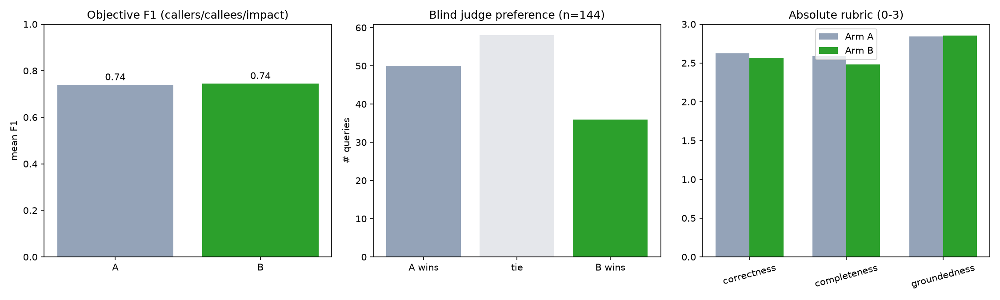
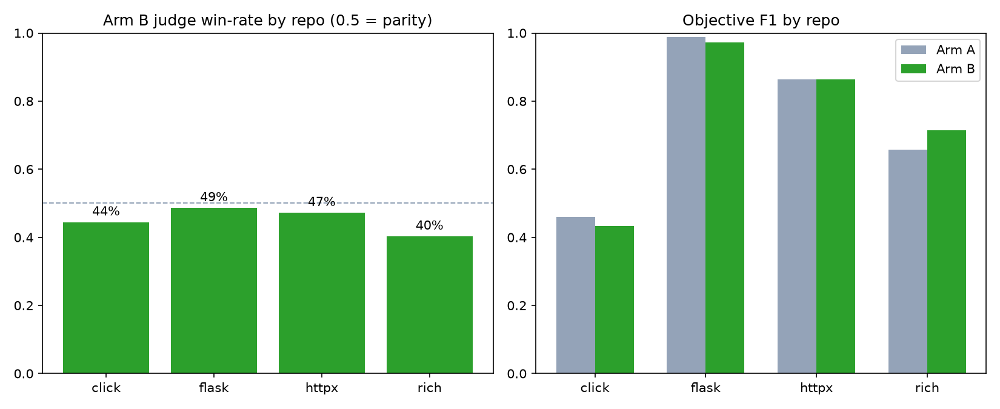
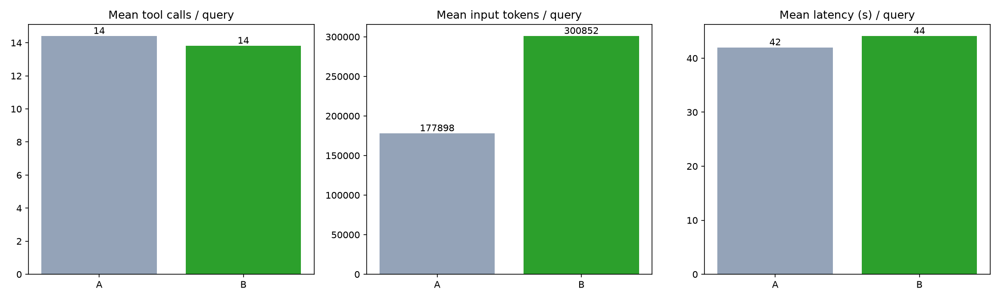

# ContextAI vs. traditional tools — Codex agentic evaluation results

Real-LLM evaluation: the [Codex CLI](https://developers.openai.com/codex) (`codex exec`, model `gpt-5-codex`) answers the same code-understanding questions twice per query — once with its native tools only (**Arm A**), once with the same tools **plus the ContextAI `contextai-graph` MCP server** (**Arm B**). Codex decides itself which tools to call. See [`METRICS.md`](METRICS.md) for the full scoring contract.

## 1. What we built

The question this evaluation answers: **does giving a real coding agent access to ContextAI's code-graph MCP tools make it better at understanding code**, compared to the same agent using only its own native tools? We built a full, reproducible harness to answer this with real agent runs rather than a hand-wavy comparison.

The harness has five stages, each a standalone script under `eval/`:

1. **Fetch** (`fetch.py`) — clone and pin four real, widely-used open-source Python projects at fixed release tags: `flask` (9k LOC), `click` (10k LOC), `httpx` (9k LOC), and `rich` (26k LOC). Pinned versions mean results are reproducible — the code under test can't drift.
2. **Build graphs** (`build_graphs.py`) — for each repo, have Codex itself call ContextAI's `build_graph` tool once, up front (see §3).
3. **Run** (`codex_runner.py` / `run_codex.py`) — for each of 48 hand-written code-understanding questions (12 per repo, across 6 question types — see §4), run the real **Codex CLI** twice: once with only its native tools (**Arm A**), once with the same tools plus ContextAI's MCP server (**Arm B**). Each (question, arm) pair is repeated 3x to smooth out model randomness, for 288 total agent runs.
4. **Score** (`score.py`) — for questions with an objectively checkable answer ("who calls X"), compute precision/recall/F1 against ground truth computed independently with `jedi` (real static analysis, unrelated to ContextAI).
5. **Judge** (`judge.py`) — for every question, a separate LLM judge blindly compares the Arm A and Arm B answers (order randomized, labels hidden) and picks a winner, plus scores each on a 0-3 rubric.

One design principle held throughout the whole harness: **ContextAI is only ever touched by Codex itself** — the tool actually under evaluation. None of our own orchestration code calls the ContextAI MCP server directly (not even to build the graphs); every single interaction with it happens because Codex, acting as an agent, decided to call it.

## 2. The ContextAI code graph — what it is and why it should help

Most code-understanding questions — "who calls this function," "what does this call," "what breaks if I change this," "trace this request end to end" — are really **graph traversal questions** over the codebase's call structure. An agent using only grep/read has to reconstruct that structure by hand: search for a name, open each hit, mentally note which function it's inside, repeat. ContextAI's `build_graph` tool does that reconstruction once, up front, via static analysis, and hands the agent a queryable structure instead.

Concretely, `build_graph(project_root, output)` walks a Python project and produces a JSON graph:

- **Nodes** — one per function, method, class, file, or external library, each carrying an id (e.g. `app.py::Flask::wsgi_app`), its type, source location, and — for functions — rich metadata: full source, signature, side effects (e.g. `EMITS_EVENT`), error handling (`has_try_catch`, `catches`), cyclomatic complexity, test coverage, and even version/git history.
- **Edges** — typed relationships between nodes: `CALLS`, `CONTAINS` (class → method), `IMPORTS`, `RETURNS`, each with a criticality rating and whether it's confirmed only statically or also seen at runtime.
- **Gaps** — the graph is honest about what static analysis can't resolve. A `list_gaps` tool reports `unresolved_calls` and `dynamic_gaps` (decorators, dynamic dispatch, registry lookups) per node — cases a purely static pass can miss. This turns out to matter a lot for our results (see "Deep dive" in §5 below).

Once built, the graph is queried through four read tools: `find_node` (search by name), `get_context` (a node plus its neighbors/edges, with source code attached), `get_edge_path` (the direct relationship between two specific nodes), and `list_gaps`. We built the graph **once per repo**, not per question, since static analysis is comparatively expensive and the codebase doesn't change between questions.

## 3. How the MCP server was built and connected

ContextAI ships as `contextai-mcp`, a Python package implementing a real [Model Context Protocol](https://modelcontextprotocol.io) server that speaks over stdio — the same protocol Cursor, Claude Code, and Codex all support natively for extending an agent with custom tools. We installed it via `pip install contextai-mcp contextai-graph` (pinned versions in `requirements.txt`) and connected it to Codex exactly the way a real user would: as a registered MCP server, not through any special integration code.

**Connecting it to Codex.** Codex CLI reads MCP server definitions from `config.toml`:

```toml
[mcp_servers.contextai-graph]
command = "python3"
args = ["-m", "contextai_mcp"]
cwd = "/workspace/eval"
```

We registered this with `codex mcp add contextai-graph -- python3 -m contextai_mcp`. Once registered, Codex spawns the server as a subprocess at session start and can call any of its tools (`build_graph`, `find_node`, `get_context`, `get_edge_path`, `list_gaps`, plus `load_graph`/`run_trace`/`merge_trace`, which we didn't need for these read-only questions) exactly like its own built-in tools.

**Isolating the two arms.** To make the comparison clean, we created two completely separate `CODEX_HOME` directories (Codex's config/auth root, normally `~/.codex`) — `_codex_home/no_mcp` for Arm A and `_codex_home/with_mcp` for Arm B — each independently authenticated. `contextai-graph` is registered in the `with_mcp` config only. This means the *only* difference between what Arm A and Arm B can do is the presence of this one MCP server; model, sandbox policy, approval settings, and prompt are byte-for-byte identical.

**A real bug we found and fixed.** The MCP server subprocess (`python3 -m contextai_mcp`) is a `python -m` invocation, which Python resolves by adding the *current working directory* to `sys.path[0]`. If that cwd is inside a target repo, and the repo happens to ship a file with the same name as a stdlib module, the import gets silently hijacked. Flask ships `src/flask/typing.py` — so running the MCP server with its cwd inside Flask's source tree breaks the import of the real stdlib `typing` module and crashes the server on startup (`AttributeError: partially initialized module 'typing' has no attribute 'TYPE_CHECKING'`). We fixed this by pinning the server's own `cwd` to `eval/` (via the `cwd` key shown above), which never collides with a target repo's module names — while Codex's own agent loop still runs with its working root inside the target repo as normal, unaffected.

**A real CLI limitation we worked around.** Codex's non-interactive mode (`codex exec`) currently requires interactive approval for MCP tool calls, which can't be granted headlessly and so auto-cancels by default — a known open issue ([openai/codex#24135](https://github.com/openai/codex/issues/24135)). We used `--dangerously-bypass-approvals-and-sandbox` to work around this, applied identically to *both* arms (not just Arm B), so reduced sandboxing isn't a hidden confound — only tool availability differs between arms. This is a contained, disclosed trade-off: read-oriented questions against pinned, throwaway repo clones, not untrusted external input.

## 4. How testing was done

**Questions.** 48 hand-written, symbol-grounded questions, 12 per repo, spanning six reasoning types: `callers` (reverse edges), `callees` (forward edges), `flow` (multi-hop execution tracing), `impact` (blast-radius / transitive reverse reachability), `definition` (where/how something is defined), and `feature` (how a cross-cutting concern works across modules). The first three types (`callers`/`callees`/`impact`) have an objective, checkable answer; all six are judged.

**Running each question.** For every `(question, arm, repeat)` combination, we invoke `codex exec` with Codex's working directory set to the target repo's source root, and a JSON-schema-constrained final response so Codex must return a prose `answer` plus — for objectively-scorable questions — a structured `symbols` list (`{file, name}` pairs). This gets us exact, parseable answers instead of scraping free text. Every run's full raw tool-call transcript (every tool called, its arguments, and its result) and every field of its final answer are saved to disk.

**Scoring, two independent ways.** Objective scoring compares Codex's structured symbol list against ground truth computed by `jedi` (real static analysis, run independently of both ContextAI and Codex) via precision/recall/F1. Subjective scoring uses a **separate** LLM (`o3`, a different model from the `gpt-5-codex` answerer, to avoid a model preferring its own style) as a blind judge: it sees the question, the reference answer key when available, and both answers with **labels stripped and order randomized**, then picks a winner and scores each 0-3 on correctness/completeness/groundedness.

**Scale.** 48 questions x 2 arms x 3 repeats = 288 agent runs, plus 144 judge calls (one per question/repeat pair, each comparing both arms at once). All runs completed with **zero failures**. The full pipeline is reproducible end to end via `make eval`.

---

## 5. Test results

### Headline: blind judge win-rate

Arm B win-rate over Arm A (ties = 0.5): **45.1%** across 144 judged queries — A wins 50, ties 58, B wins 36.



### Objective correctness (callers / callees / impact)

| Arm | n | mean F1 |
|---|---|---|
| A | 87 | 0.740 |
| B | 87 | 0.745 |

| Query type | Arm A F1 | Arm B F1 |
|---|---|---|
| callees | 0.805 | 0.797 |
| callers | 0.844 | 0.831 |
| impact | 0.520 | 0.565 |

### Absolute rubric (0-3 per axis, judge-scored)

| Arm | Correctness | Completeness | Groundedness | Mean |
|---|---|---|---|---|
| A | 2.62 | 2.59 | 2.84 | 2.69 |
| B | 2.57 | 2.48 | 2.85 | 2.63 |

### Breakdown by repo

The headline numbers average over all 4 repos; per-repo results vary more than the average suggests, and no single repo shows Arm B clearly ahead — including `rich`, the largest/most complex codebase, where a code graph would intuitively help the most.



| Repo | Judge: A / tie / B | B win-rate | F1 (A) | F1 (B) | Rubric (A) | Rubric (B) |
|---|---|---|---|---|---|---|
| click | 13 / 14 / 9 | 44% | 0.460 | 0.432 | 2.56 | 2.54 |
| flask | 9 / 19 / 8 | 49% | 0.989 | 0.973 | 2.78 | 2.73 |
| httpx | 13 / 12 / 11 | 47% | 0.864 | 0.864 | 2.82 | 2.81 |
| rich | 15 / 13 / 8 | 40% | 0.657 | 0.714 | 2.58 | 2.46 |

### Breakdown by query type (blind judge)

| Type | A / tie / B | B win-rate |
|---|---|---|
| callees | 5 / 21 / 7 | 53% |
| callers | 11 / 12 / 7 | 43% |
| definition | 4 / 4 / 4 | 50% |
| feature | 7 / 9 / 5 | 45% |
| flow | 14 / 3 / 7 | 35% |
| impact | 9 / 9 / 6 | 44% |

Notably, `flow` (multi-hop execution tracing) — the type where a pre-built call graph should intuitively help most — has Arm B's *lowest* win-rate of any type.

### Deep dive: why did Arm B sometimes do worse?

Two distinct, verified mechanisms explain this, and they cut in different directions for how much to trust the headline win-rate.

#### 1. The judge itself is sometimes wrong (headline number is noisier than it looks)

Manual spot-check of a `flow` query Arm B "lost" (`rich-02`, repeat 1): the judge (o3) penalized Arm B for stating the print buffer is "thread-local," calling this a factual error ("the buffer is an attribute on the Console instance, not thread-local"). Checking Rich's actual source shows Arm B was correct and the judge was wrong:

```python
class ConsoleThreadLocals(threading.local):
    """Thread local values for Console context."""
...
@property
def _buffer(self) -> List[Segment]:
    """Get a thread local buffer."""
    return self._thread_locals.buffer
```

This is one manually-verified case, not an automated audit of all judged queries — but it demonstrates that some fraction of the reported win/loss split is judge noise rather than a real quality gap. With 58/144 judged queries already ties, the true gap between arms is likely smaller than the raw 45.1% vs. 54.9% split suggests.

#### 2. A real mechanism: over-trusting the graph as a complete answer

First, a sanity check on Arm B's setup itself: across all 144 successful Arm B runs, **75 used both native and ContextAI tools together**, 69 used ContextAI tools only (by choice, not necessity), and **0 were missing native tool access** — i.e. Arm B never lost capability relative to Arm A; it only ever gained the option to use ContextAI's tools. Any quality gap is therefore about how the extra tool was *used*, not about Arm B being handicapped.

Across the 87 paired (query, repeat) cases with an objective answer key, Arm B's predicted symbol set was a **strict subset** of Arm A's in 19 cases, versus only 1 case the other way around. In other words, when one arm's answer was a pure subset of the other's (never contained anything the other missed), it was Arm B's more often — the signature of trusting a single structured source over exhaustive verification.

ContextAI's graph is a static-analysis snapshot with known blind spots — the MCP server itself exposes a `list_gaps` tool specifically for `unresolved_calls` and `dynamic_gaps` (decorators, dynamic dispatch, etc. a static analyzer can't always resolve). When Codex treated `get_context`/`find_node`'s returned edges as the complete answer instead of cross-checking with a grep pass, it inherited those blind spots. Grep-based Arm A doesn't have this particular blind spot, because it searches exhaustively by construction.

Examples (`click-02` r0, `click-02` r1):

```
click-02 r0:
  gold:  ['core.py::_main_shell_completion', 'core.py::exit', 'core.py::invoke', 'core.py::make_context', 'exceptions.py::Abort', 'exceptions.py::show', 'utils.py::PacifyFlushWrapper', 'utils.py::_detect_program_name', 'utils.py::_expand_args', 'utils.py::echo']
  Arm A: ['core.py::_main_shell_completion', 'core.py::exit', 'core.py::invoke', 'core.py::make_context', 'exceptions.py::show', 'utils.py::_detect_program_name', 'utils.py::_expand_args', 'utils.py::echo']
  Arm B: ['core.py::_main_shell_completion', 'core.py::invoke', 'core.py::make_context', 'utils.py::_detect_program_name', 'utils.py::_expand_args', 'utils.py::echo']   (strict subset of A's answer)

click-02 r1:
  gold:  ['core.py::_main_shell_completion', 'core.py::exit', 'core.py::invoke', 'core.py::make_context', 'exceptions.py::Abort', 'exceptions.py::show', 'utils.py::PacifyFlushWrapper', 'utils.py::_detect_program_name', 'utils.py::_expand_args', 'utils.py::echo']
  Arm A: ['core.py::_main_shell_completion', 'core.py::exit', 'core.py::invoke', 'core.py::make_context', 'exceptions.py::show', 'utils.py::_detect_program_name', 'utils.py::_expand_args', 'utils.py::echo']
  Arm B: ['core.py::_main_shell_completion', 'core.py::invoke', 'core.py::make_context', 'utils.py::_detect_program_name', 'utils.py::_expand_args', 'utils.py::echo']   (strict subset of A's answer)

```

**Takeaway**: more tool capability doesn't guarantee better use of it. A tool that returns a fast, confident, structured answer can let an agent skip the slower verification step it would otherwise do — and that answer can be silently incomplete. This suggests ContextAI's tools (or prompting around them) should nudge agents to treat the graph as a lead to verify for exhaustive-enumeration questions ("who calls X"), not a final answer.

### Efficiency



| Arm | n | mean tool calls | mean MCP calls | mean input tokens | mean output tokens | mean latency (s) | % used ContextAI |
|---|---|---|---|---|---|---|---|
| A | 144 | 14.4 | 0.0 | 177898 | 2734 | 42.0 | n/a |
| B | 144 | 13.8 | 10.0 | 300852 | 2534 | 44.1 | 100% |

Total runs: 288, failed: 0.

### Methodology notes / deviations from METRICS.md

- **Answerer**: Codex CLI (`codex exec`, model `gpt-5-codex`), not a raw OpenAI chat completion — chosen so the comparison reflects a real, widely-used coding agent rather than a custom-built minimal tool loop.
- **Judge**: `o3` (a distinct OpenAI model from the answerer), blind, pairwise order randomized, given the objective answer key as reference when available.
- **Sandbox**: both arms run with `--dangerously-bypass-approvals-and-sandbox`. Codex's non-interactive mode currently auto-cancels MCP tool call approvals instead of allowing them (see [openai/codex#24135](https://github.com/openai/codex/issues/24135)), so Arm B needs the bypass to use ContextAI at all; it is applied uniformly to Arm A too so the *only* difference between arms is tool availability, not sandboxing. This is a contained, documented trade-off: read-oriented questions against pinned, throwaway clones.
- **Tool-call budget**: METRICS.md specifies a 25-tool-call cap; the Codex CLI has no native per-run tool-call limit, so a wall-clock timeout is used instead as the safety bound.
- ContextAI is only ever accessed by Codex itself (via the `contextai-graph` MCP server registered in Codex's own config) — never by the harness's orchestration code directly.
