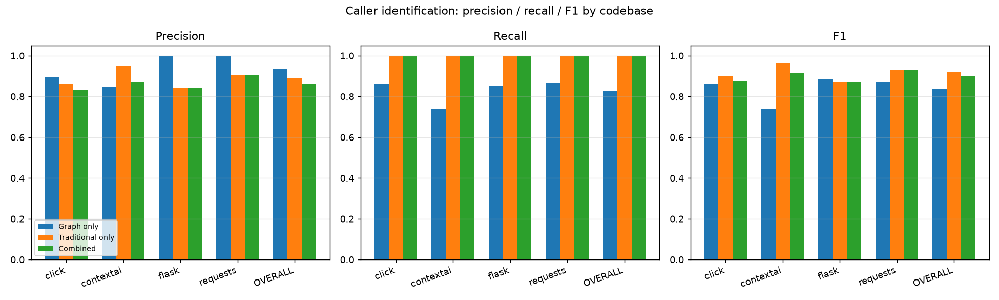
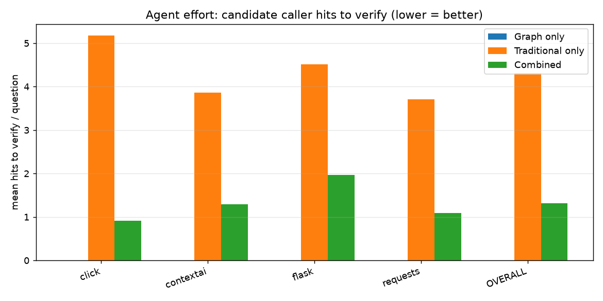

# ContextAI code-graph vs traditional context retrieval

Question tested: **does giving an LLM the ContextAI code-graph MCP tools, *alongside* traditional grep/read, produce better context than traditional tools alone?** Task: *"which functions call F?"* — the atom of code navigation an agent performs constantly.

## Headline (pooled over all questions)

- Questions: **140** focal functions across **4** real codebases.
- **Graph only** is the most precise (**93.3%**) and needs **zero** verification, but misses callers (recall **82.8%**).
- **Traditional only** reaches full recall but is noisy (precision **89.0%**) and forces the agent to vet **4.3** candidate hits/question.
- **Combined** keeps full recall (**100.0%**) while cutting candidates-to-verify by **69%** (**4.3 → 1.3**), anchored by the graph's high-precision core.

**Takeaway: neither tool alone is best. The graph supplies a precise, zero-cost backbone; traditional search closes the recall gap; together they give complete context with the least review effort.**

## Overall

| Arm | Precision | Recall | F1 | Effort (hits to verify) |
|---|---|---|---|---|
| Graph only | 0.933 | 0.828 | 0.836 | 0.00 |
| Traditional only | 0.890 | 1.000 | 0.918 | 4.31 |
| Combined | 0.861 | 1.000 | 0.899 | 1.32 |

## Per-codebase

### click  (34 questions)

| Arm | Precision | Recall | F1 | Effort (hits to verify) |
|---|---|---|---|---|
| Graph only | 0.895 | 0.862 | 0.861 | 0.00 |
| Traditional only | 0.862 | 1.000 | 0.899 | 5.18 |
| Combined | 0.832 | 1.000 | 0.875 | 0.91 |

### contextai  (37 questions)

| Arm | Precision | Recall | F1 | Effort (hits to verify) |
|---|---|---|---|---|
| Graph only | 0.845 | 0.737 | 0.737 | 0.00 |
| Traditional only | 0.948 | 1.000 | 0.967 | 3.87 |
| Combined | 0.870 | 1.000 | 0.916 | 1.30 |

### flask  (35 questions)

| Arm | Precision | Recall | F1 | Effort (hits to verify) |
|---|---|---|---|---|
| Graph only | 0.997 | 0.852 | 0.883 | 0.00 |
| Traditional only | 0.843 | 1.000 | 0.875 | 4.51 |
| Combined | 0.840 | 1.000 | 0.873 | 1.97 |

### requests  (34 questions)

| Arm | Precision | Recall | F1 | Effort (hits to verify) |
|---|---|---|---|---|
| Graph only | 1.000 | 0.868 | 0.873 | 0.00 |
| Traditional only | 0.903 | 1.000 | 0.928 | 3.71 |
| Combined | 0.903 | 1.000 | 0.928 | 1.09 |

## Method

- **Ground truth**: jedi static resolution of every in-repo *call site* of F (import/alias/scope aware), mapped to the enclosing function. Independent of the system under test.
- **Graph only**: `CALLS` edges into F from the graph built by the real `build_graph` MCP tool.
- **Traditional only**: `grep` for `F(` across the repo, each hit mapped to its enclosing function (what a grep-driven agent gets, including false positives from comments, strings, and same-named attribute calls).
- **Combined**: graph edges ∪ grep hits.
- **Effort**: candidate hits an agent must manually verify — all grep hits for traditional; only grep hits *not already confirmed by the graph* for combined; zero for the (pre-resolved) graph.
- **Sampling**: the most-connected functions per repo (the ones agents actually ask about); only functions with >=1 real caller are scored.

## Honest limitations

- The graph's recall gap comes from static-analysis blind spots (dynamic dispatch, some method calls) found during exploration — exactly why traditional search remains necessary.
- Grep's recall is high for text call sites but its precision/effort cost is the price the graph removes.
- Keys are normalized to `relpath::simple_name`; rare same-name collisions in one file are possible.
